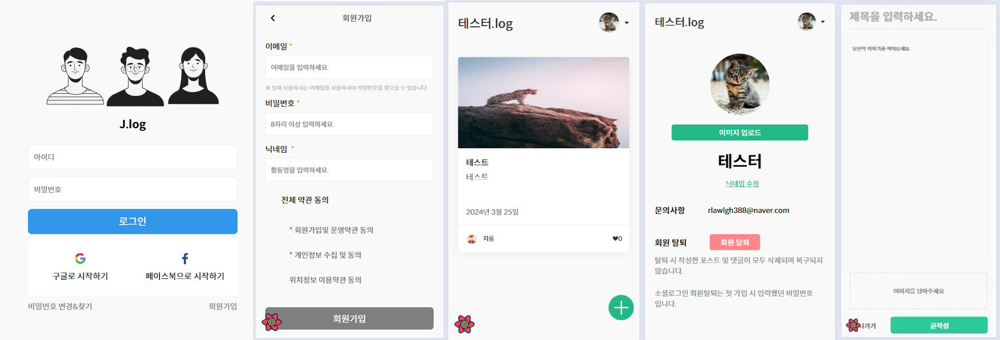

# 벨로그 클론코딩

 

본 프로젝트는 사이트 기획과 디자인 기간 단축을 위해 클론코딩으로 이루어져 있으며 다음과 같은 기술들을 사용합니다.

- 개발 언어 : Typescript & React
- 개발 환경 : Next.js 14
- UI 스타일링 : emotion & SCSS
- 컴포넌트 관리 : Storybook
- library : react-hook-form (form 전용 library)
- 클라이언트 상태관리 : zustand
- 서버 상태관리 : React Query
- 사용 DB : Firebase
- API : Next.js Api Route
- 테스트 : Jest + RTL
- 형상관리 : github
- 배포 : vercel
   
   

## Preview

  

## directory tree

📦 src 
├── 📂 test # jest로 만들어진 테스트 코드가 있습니다. 
 
├── 📂 apis # API 요청을 보내는 코드입니다 
│ ├── 📄 api handler # api 요청을 하는 handler 입니다. 
│ ├── 📄 mutation # api요청을 관리하고 onSuccess와 onError를 담당합니다. 
│ └── 📄 query hook # react-query의 useQuery를 hook으로 만들어 사용합니다. 
 
├── 📂 asset # 공용으로 사용하는 css와 scss 등이 있습니다. 
 
├── 📂 app # 프로젝트의 Page가 있는 곳 입니다. 
│ ├── 📂 @modal #page를 모달 팝업으로 사용 할 수 있도록 하는 인터셉팅 라우팅 역할을 합니다 
│ ├── 📂 api # API route가 저장된 곳 입니다. 
│ │ ├── 📄 route.ts # GET,POST,PUT,DELETE 메소드가 존재합니다,
(이곳에서 api 요청에 대한 response를 return 합니다) 
│ ├── 📂 page # 각 페이지의 파일이 있습니다 
│ │ ├── 📄 page.tsx # react-query의 prefetch를 담당하는 서버컴포넌트와 seo 함수가 있습니다. 
│ │ ├── 📄 Client.tsx # 파일에 useClient가 선언되며 파일의 전반적인 UI와 함수로직이 존재합니다. 
│ │ ├── 📄 style.(scss || ts) # page의 스타일을 구성하는 scss 파일 입니다. 
│ │ ├── 📂 components # 페이지의 component가 저장된 곳 입니다. 
 
├── 📂 components # 프로젝트에서 공용으로 사용하는 components를 저장하는 곳 입니다. 
│ ├── 📂 atoms # 가장 작은 단계의 공용 컴포넌트를 저장하는 곳 입니다. 
│ │ ├── 📂 (component) # input,checkbox,button,popup,,image 등이 존재합니다. 
│ │ │ ├── 📄 component.tsx 
│ │ │ ├── 📄 component.stories.tsx 
│ │ │ ├── 📄 style.ts # component의 스타일을 구성하는 emotion 파일 입니다. 
 
├── 📂 lib # 라이브러리에 관련된 파일을 저장하는 곳 입니다. 
├── 📂 provider #Provider 파일을 저장하는 곳 입니다. 
├── 📂 static # 정적 파일 (상수로 선언되는 변수들을 저장하는 곳 입니다) 
├── 📂 store # 클라이언트로 사용되는 상태를 전역으로 관리 하는 곳 입니다. 
├── 📂 utils # 유틸리티 함수를 저장하는 곳 입니다. 
└── 📄 middleware.ts # Next.js 자체 middleware로 로그인 상태에 따라 redirect를 담당합니다.

## 각 페이지 별 주요 로직 소개

## 📌 로그인 프로세스

1. **ID/PW 입력**
2. **로그인 API 요청**
3. **로그인 성공 시, HTTPOnly 쿠키 생성 (1시간 유효)**
4. **메인 페이지로 이동**

## 🔍 구현 시 기억에 남는 점

- Firebase를 이용하여 로그인할 경우, 기본적으로 로그인 정보가 `localStorage`에 저장됨.
- `localStorage`에 저장된 로그인 정보는 삭제 전까지 유지되지만, 보안 강화를 위해 `localStorage`에 저장하는 것이 아닌 쿠키를 발급하여 저장하고 일정 시간이 지나면 자동 로그아웃되도록 설계.
- 이를 위해 `HTTPOnly 쿠키`를 생성하여 1시간 동안 유효하게 유지하며, 쿠키가 삭제되면 자동 로그아웃되도록 구현함.
